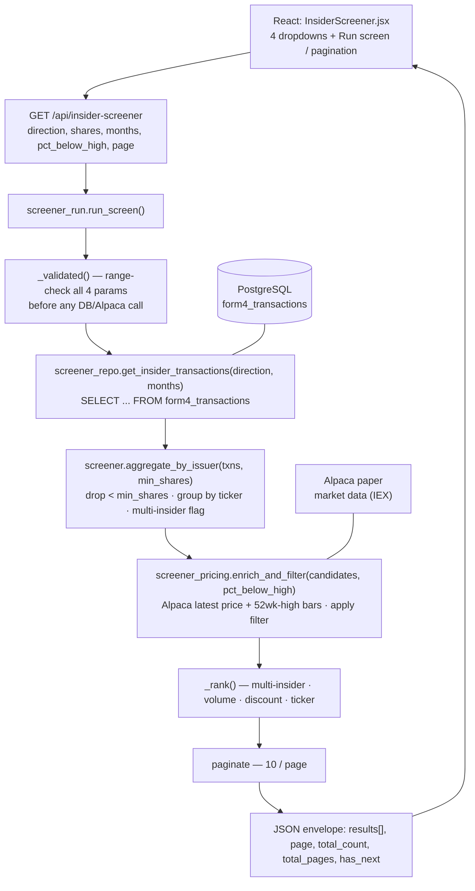
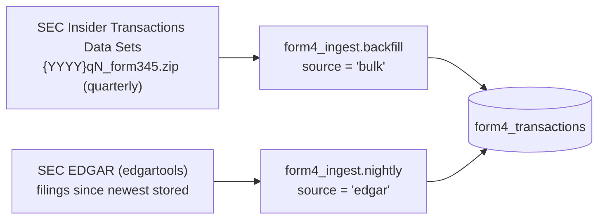

# Insider-Transaction Screener — Architecture

Epic: **SCRUM-29** (screener) · **SCRUM-42** (Form 4 data store)

> This file is the source of truth. Publish a copy to Confluence for the wider
> team (see SCRUM-41) — keep this one and the Confluence page in sync, or link
> Confluence back to this file.

## Overview

The screener turns **publicly disclosed SEC Form 4 insider transactions** into a
ranked list of stock buy/sell ideas. The user picks four parameters; the backend
reads recent Form 4 rows from a local database, rolls them up per issuer,
enriches each with price data from Alpaca, keeps the ones trading far enough
below their 52-week high, ranks them, and returns a page of results.

**Recommendations only.** Nothing in this feature places an order. Each result
row carries `ticker + side + suggested_quantity` so it can be handed to the
existing **Stock Purchase** feature (SCRUM-3), where the user acts on it.

## Request flow



**No SEC/EDGAR call happens on the request path.** Live EDGAR parsing was the
original design; it was too slow (a market-wide multi-month pull is ~hundreds of
thousands of filings, one HTTP fetch each) and was retired in SCRUM-48. The
`form4_transactions` table is filled **offline** instead:



## Components

| Module | Responsibility | Story |
| --- | --- | --- |
| `src/pages/InsiderScreener.jsx` | Parameter form, results table, multi-insider badge, expandable filings, pagination, empty/error states | 37 / 38 / 39 / 47 |
| `backend/app.py` `/api/insider-screener` | HTTP entry; classifies any error via `screener_errors` | 35 / 36 |
| `backend/screener_run.py` | `run_screen()` — validate → source → aggregate → price → rank → paginate → shape rows | 35 / 36 |
| `backend/screener_repo.py` | `get_insider_transactions(direction, months)` — the only Form 4 source; queries `form4_transactions` | 46 |
| `backend/screener.py` | `aggregate_by_issuer()` — share-size threshold, per-issuer roll-up, `multiple_insiders` flag | 33 |
| `backend/screener_pricing.py` | `enrich_and_filter()` — Alpaca price + 52-week-high, the `pct_below_high` filter | 34 |
| `backend/screener_errors.py` | `classify(exc)` → `(message, status, log)` | 36 |
| `backend/alpaca_client.py` | Batched `get_latest_prices()` / `get_52_week_highs()`; paper-pinned trading client | 31 / 34 |
| `backend/db.py`, `backend/migrate.py` | `DATABASE_URL` connection helper; numbered `.up/.down.sql` migration runner | 43 |
| `backend/form4_ingest/` | `backfill` (quarterly bulk), `nightly` (EDGAR gap-fill), `bulk`/`edgar` parsers, `store` (upsert) | 44 / 45 |

## The `form4_transactions` store

One row per non-derivative **open-market** transaction line (`P` = purchase,
`S` = sale) on a Form 4.

| Column | Notes |
| --- | --- |
| `issuer_ticker`, `issuer_cik`, `issuer_name` | Issuer |
| `insider_name`, `insider_cik` | Reporting owner |
| `transaction_code` | `P` or `S` (CHECK constraint) |
| `transaction_date`, `filing_date` | |
| `shares`, `price` | `price` nullable |
| `accession_no`, `trans_sk` | Natural key `UNIQUE (accession_no, trans_sk)` |
| `source` | `bulk` or `edgar` |

Indexes: `(issuer_ticker, transaction_date)` and `(transaction_code, transaction_date)`
— the latter backs the screener's `WHERE transaction_code = %s AND transaction_date >= %s`.

**Cross-source supersede:** a `bulk` load deletes any `edgar` rows for the
filings it touches, and the nightly job skips filings already covered by `bulk`.
Authoritative quarterly data always wins.

## Ingest

**Quarterly backfill** — `python -m form4_ingest.backfill <dir-or-zip> ...`
Parses SEC's [Insider Transactions Data Sets](https://www.sec.gov/data-research/sec-markets-data/insider-transactions-data-sets)
(`SUBMISSION` / `REPORTINGOWNER` / `NONDERIV_TRANS` TSVs, ~13 MB zipped/quarter).
Only `P`/`S` rows are loaded. Idempotent (upsert on the natural key).

**Nightly gap-fill** — `python -m form4_ingest.nightly`
The quarterly set lags a quarter or more, so a nightly job pulls Form 4s filed
since the newest stored `filing_date` via `edgartools`, synthesizes a stable
`trans_sk` per line, and upserts P/S rows as `source='edgar'`. Requires the
`EDGAR_IDENTITY` env var (SEC mandates a `name email` identity on every request).
Wire into cron — see SCRUM-49. Exits non-zero on failure.

## Request-path dependencies & failure modes

| Dependency | Used for | Failure → response |
| --- | --- | --- |
| PostgreSQL (`form4_transactions`) | The Form 4 transaction source | `DatabaseNotConfigured` (no `DATABASE_URL`) → **503**, logged with a trace (deploy misconfig). `psycopg.Error` (DB down) → **503**, one-line warning, no connection detail leaked. |
| Alpaca paper — market data | Current price + ~53 weeks of daily bars for the 52-week high | `AlpacaConfigError` (no creds) → **503**, logged. Alpaca HTTP **429** → **503** "rate-limited, try again in a minute". Other `APIError` → **502**. All show a generic "market price data unavailable". |
| Bad request parameter | — | `ScreenerParamError` → **400**, validator message verbatim. Validated **before** any DB or Alpaca call. |
| Unexpected error | — | **500**, generic "something went wrong", logged with a stack trace. |

The response body is always a clean message — never a stack trace or connection
string. A screen that ran fine and simply matched nothing returns
`{"results": [], "total_count": 0, ...}` — structurally distinct from
`{"error": ...}`, so the UI shows a "no matches" state, not an error.

## Parameters

| Dropdown | Values | Default | Meaning |
| --- | --- | --- | --- |
| Direction | Purchase / Sold | Purchase | Form 4 transaction code — `P` or `S`. |
| Insider trade size | 5000 / 10000 / 15000 / 20000 | 10000 | **Signal threshold** on each Form 4 transaction — only transactions of at least this many shares count. **Not** a purchase quantity. |
| Months to review | 1–6 | 1 | `transaction_date` lower bound — the trailing N calendar months. |
| % below 52-week high | 50 / 60 / 70 / 80 / 90 / 100 | 70 | How far **below** its 52-week high a stock must trade. Keep a ticker when `current_price ≤ fifty_two_week_high × (100 − N) / 100`. N=70 keeps stocks at ≤30% of their high. N=100 is degenerate (ceiling $0) and always yields no matches. |

## Multi-insider flag

`multiple_insiders` is set on an issuer when **≥2 distinct insiders** transacted
in the same direction. Distinct is by **insider CIK**, falling back to lowercased
name only when a filing carried no CIK. (All rows in a group already share an
issuer and direction, so "same direction, same issuer" is implicit.)

## Ranking

Deterministic, all descending, ties broken by ticker ascending:

1. `multiple_insiders` (flagged issuers first)
2. Aggregate insider share volume (sum of qualifying transactions)
3. Discount to the 52-week high (`1 − price / high`)
4. Ticker (ascending) — tiebreak

## Result contract

**Envelope:** `{ results: [...], page, page_size (10), total_count, total_pages, has_next }`

**Row:**

```json
{
  "ticker": "TRDA",
  "company": "Entrada Therapeutics, Inc.",
  "side": "sell",                 // "buy" for P, "sell" for S
  "insider_count": 2,
  "multiple_insiders": true,
  "insiders": ["A Person", "B Person"],
  "total_insider_shares": 313570,
  "current_price": 7.28,
  "fifty_two_week_high": 16.45,
  "discount_pct": 55.7,
  "suggested_quantity": 10000,    // = the selected "Insider trade size"
  "filings": [
    { "accession_no": "...", "filing_date": "...", "transaction_date": "...",
      "insider_name": "...", "shares": 200000, "price": 7.5 }
  ]
}
```

**Hand-off to Stock Purchase (SCRUM-3):** `ticker` + `side` + `suggested_quantity`.
`suggested_quantity` is the selected insider-trade-size value — the size of the
insider activity that made this a candidate.

## Data freshness & known limitations

- **Data window** is the *Months to review* selector, served from the DB. (This
  replaced the old "~1 day of filings" limit that the retired live-EDGAR path
  had.)
- **Freshness lag.** The quarterly bulk set is published weeks after quarter
  end; the nightly EDGAR job fills the gap up to "yesterday". Until the nightly
  job has run, the most recent day or two of filings may be missing. The UI
  carries a freshness note to this effect.
- **Alpaca free tier = IEX feed.** The 52-week high is computed from ~53 weeks
  of daily bars (no direct field). Tickers with **fewer than 200 daily bars**
  (recent listings) are dropped as "insufficient history" rather than shown with
  a misleading discount off a partial-year high.
- **Un-priceable tickers.** Form 4 issuer tickers include foreign listings /
  units / warrants (e.g. digit-containing `AXIA3`) that Alpaca's US-equity data
  can't price and that 400 the whole batch. These are filtered by symbol shape
  up front; anything that slips through triggers a per-symbol fallback.
- **`pct_below_high = 100`** is degenerate — the price ceiling is $0, so it
  always returns no matches.
- **Pricing cost scales with candidate count.** A wide months window that
  produces a few hundred candidates makes a couple hundred Alpaca requests and
  can take ~20–30 s; the UI keeps the previous results visible and shows
  "Screening…". If this becomes a problem, cache prices or narrow the candidate
  set before pricing.

## Related work

| | |
| --- | --- |
| SCRUM-3 | Stock Purchase — where a recommendation is executed |
| SCRUM-42 | Form 4 bulk ingest / DB store (this data layer) |
| SCRUM-49 | Cron scheduling + ops docs for the nightly ingest |
| SCRUM-50 | Provision PostgreSQL on the production host |
